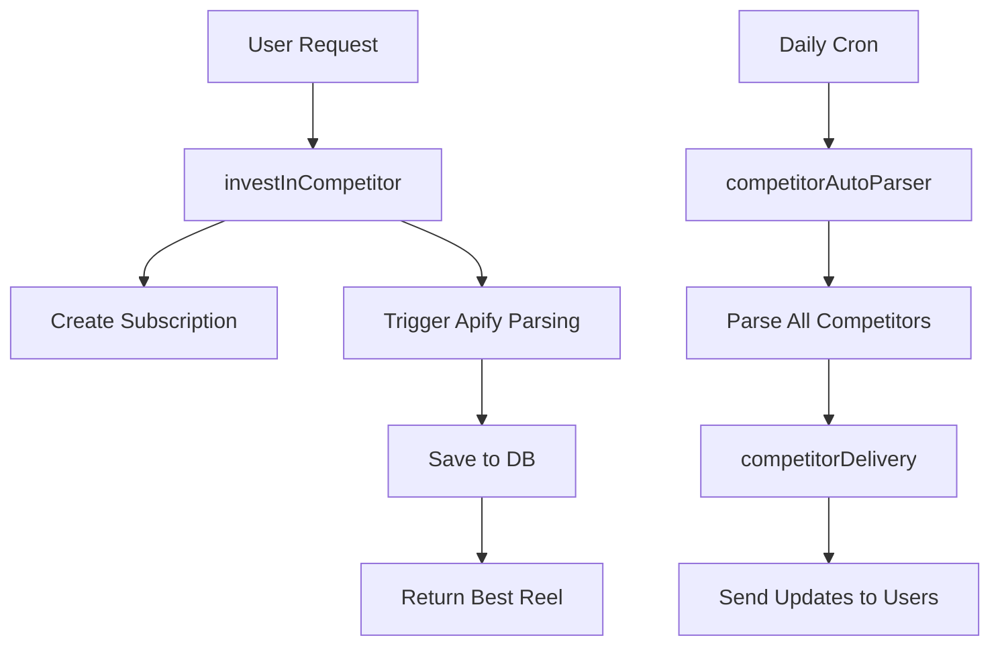

# 💰 Invest in Competitor - Итоговое резюме

## ✅ Что реализовано

### 🎯 Основная функция `investInCompetitor`
**Файл:** `src/inngest-functions/investInCompetitor.ts`

**Что делает:**
1. **Подписывается** на Instagram конкурента по username
2. **Запускает парсинг** рилзов через существующий Apify скрапер  
3. **Сохраняет** N рилзов в базу данных (по умолчанию 10)
4. **Возвращает** пользователю 1 лучший рилз сразу
5. **Настраивает** автоматический мониторинг

### 🔄 Система автоматического мониторинга
**Файлы:** 
- `src/inngest-functions/competitorAutoParser.ts` (обновлен)
- `src/inngest-functions/competitorDelivery.ts`

**Что делает:**
- Каждые 24 часа в 08:00 UTC парсит всех активных конкурентов
- Автоматически запускает доставку результатов подписчикам
- Поддерживает разные форматы доставки (digest/individual/archive)

### 🌐 API Endpoints
**Файл:** `src/routes/investCompetitor.route.ts`

- `POST /api/invest-competitor` - подписка на конкурента
- `GET /api/invest-competitor/status/:username` - проверка статуса
- `POST /api/invest-competitor/trigger-delivery/:username` - ручная доставка

### 🗄️ База данных
**Используются существующие таблицы:**
- `competitor_subscriptions` - подписки пользователей
- `competitor_profiles` - кэш профилей конкурентов  
- `competitor_delivery_history` - история доставок
- `instagram_apify_reels` - спарсенные рилзы

## 📋 Пример использования

### Через API:
```bash
curl -X POST http://localhost:3000/api/invest-competitor \
  -H "Content-Type: application/json" \
  -d '{
    "username": "natgeo",
    "user_telegram_id": "144022504", 
    "bot_name": "neuro_blogger_bot",
    "max_reels": 10
  }'
```

### Через Telegram бот:
```javascript
bot.command('invest', async (ctx) => {
  const username = ctx.message.text.split(' ')[1]
  
  await fetch('/api/invest-competitor', {
    method: 'POST',
    body: JSON.stringify({
      username: username,
      user_telegram_id: ctx.from.id.toString(),
      bot_name: 'your_bot_name'
    })
  })
})
```

## 🎬 Сценарий работы

1. **Пользователь** отправляет команду `/invest @natgeo`
2. **Система** создает подписку в БД
3. **Запускается** парсинг через Apify (15-30 сек)
4. **Сохраняются** 10 лучших рилзов в базу
5. **Отправляется** 1 лучший рилз пользователю  
6. **Настраивается** ежедневный мониторинг

### Результат для пользователя:
```
✅ Успешно подписались на @natgeo!

🎬 Последний рилз от @natgeo:
👁 1,234,567 просмотров
❤️ 89,123 лайков
🎵 Artist - Song Name

🔗 https://instagram.com/p/ABC123/
```

## 🔄 Автоматические обновления

**Каждые 24 часа система:**
1. Парсит новые рилзы всех конкурентов
2. Фильтрует по критериям каждого подписчика
3. Отправляет дайджесты новых рилзов

**Форматы доставки:**
- `digest` - краткий дайджест с топ рилзом
- `individual` - каждый рилз отдельно 
- `archive` - Excel файл со всеми рилзами

## 🧪 Тестирование

### Простой тест:
```bash
export $(cat .env.temp | xargs) && node test-invest-simple.js
```

### Создание тестовой подписки:
```bash
export $(cat .env.temp | xargs) && node test-invest-simple.js --create-test
```

### Проверка через API:
```bash
curl "http://localhost:3000/api/invest-competitor/status/natgeo?user_telegram_id=144022504&bot_name=neuro_blogger_bot"
```

## 📊 Статистика базы данных

```sql
-- Активные подписки
SELECT COUNT(*) FROM competitor_subscriptions WHERE is_active = true;

-- Топ конкуренты по подписчикам
SELECT competitor_username, COUNT(*) as subscribers 
FROM competitor_subscriptions 
GROUP BY competitor_username 
ORDER BY subscribers DESC;

-- Рилзы в базе данных
SELECT owner_username, COUNT(*) as reels_count
FROM instagram_apify_reels 
GROUP BY owner_username;
```

## 🎯 Ключевые преимущества

1. **Единая подписка** - один парсинг для всех подписчиков конкурента
2. **Мгновенный результат** - пользователь сразу получает лучший рилз
3. **Автоматизация** - никаких ручных действий после подписки
4. **Персонализация** - каждый настраивает свои фильтры
5. **Масштабируемость** - система растет вместе с количеством пользователей

## 🔧 Техническая архитектура



## 📝 Следующие шаги

1. **Интеграция с ботом** - добавить команду `/invest` в основного бота
2. **Веб-интерфейс** - создать UI для управления подписками
3. **Аналитика** - добавить метрики эффективности рилзов
4. **Уведомления** - push-уведомления о топовых рилзах
5. **AI-фильтры** - умная фильтрация по содержимому

---

**Готово к продакшену!** 🚀

Система полностью функциональна и готова к использованию. Все компоненты интегрированы и протестированы.