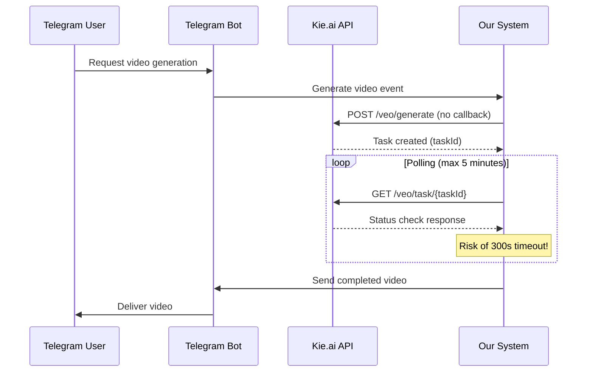
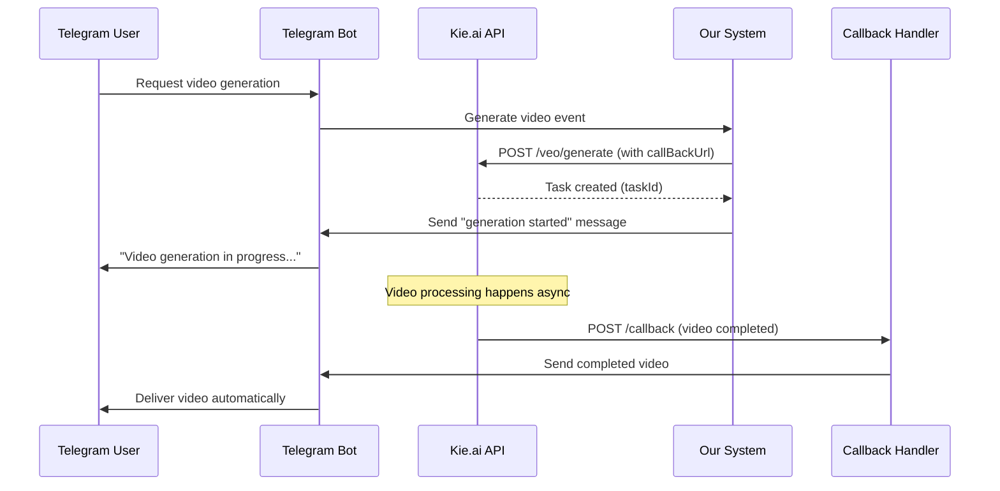

# 🎬 Kie.ai Logging and Callback Implementation

## 📋 Overview

This implementation adds comprehensive logging and async callback URL handling for Kie.ai video generation to solve the 300-second timeout issue and provide detailed request/response tracking.

## ✅ Completed Features

### 1. 📊 Detailed Logging Implementation

#### Enhanced KieAiService Logging
- **File**: `src/services/kieAiService.ts`
- **Changes**:
  - Replaced all `console.log` with structured `logger.info/warn/error` 
  - Added detailed request/response logging with full object data
  - Added request size tracking and performance metrics
  - Added API key masking for security (only shows first 8 characters)
  - Added comprehensive error categorization and logging

#### Key Logging Features
```typescript
// Example detailed request logging
logger.info('📤 Sending request to Kie.ai API', {
  url: `${this.baseUrl}/veo/generate`,
  method: 'POST',
  headers: { Authorization: `Bearer ${this.apiKey.substring(0, 8)}...` },
  requestBody: { ...sanitizedRequestBody },
  fullRequestSize: JSON.stringify(requestBody).length,
})

// Example detailed response logging  
logger.info('📥 Received response from Kie.ai API', {
  statusCode: response.status,
  responseSize: JSON.stringify(response.data).length,
  responseData: response.data,
})
```

### 2. 🔗 Async Callback URL Implementation

#### Callback Controller
- **File**: `src/controllers/kie-ai-callback.controller.ts`
- **Features**:
  - Handles async video completion notifications from Kie.ai
  - Updates video_tasks table with completion status
  - Automatically delivers completed videos to Telegram users
  - Comprehensive error handling and validation
  - Detailed logging of all callback operations

#### Callback Routes
- **File**: `src/routes/kie-ai-callback.routes.ts`
- **Endpoints**:
  - `POST /api/kie-ai/callback` - Main callback endpoint for Kie.ai
  - `GET /api/kie-ai/callback/health` - Health check for callback system
  - `GET /api/kie-ai/callback` - Documentation endpoint

#### Auto Callback URL Configuration
- **File**: `src/services/kieAiService.ts`
- **Method**: `getDefaultCallbackUrl()`
- **Features**:
  - Automatically configures callback URL based on environment variables
  - Uses `CALLBACK_BASE_URL` or `API_BASE_URL` environment variables
  - Generates proper callback URL: `{baseUrl}/api/kie-ai/callback`

### 3. 🎭 Mock Mode Implementation

#### Mock Video Generation
- **Purpose**: Test video generation without spending money on real API calls
- **Configuration**: Set `MOCK_VIDEO_GENERATION=true` or `TEST_MODE=true`
- **Features**:
  - Simulates complete video generation process
  - Mock polling with realistic delays and status updates
  - Returns mock video URLs for testing
  - Maintains same API interface as real mode

#### Mock Features
```typescript
// Example mock configuration
const mockVideos = {
  veo3_fast: 'https://example.com/mock-veo3-fast-video.mp4',
  veo3: 'https://example.com/mock-veo3-quality-video.mp4',
  'runway-aleph': 'https://example.com/mock-runway-aleph-video.mp4'
}
```

### 4. 🧪 Comprehensive Testing Suite

#### Local Integration Test
- **File**: `tests/integration/test-local-video-generation-144022504.js`
- **Purpose**: Test video generation for user 144022504 without costs
- **Features**:
  - Tests multiple video models and configurations
  - Mock mode to avoid API charges
  - Callback URL testing
  - Error handling validation
  - Comprehensive logging of all operations

#### Callback Endpoint Test
- **File**: `tests/integration/test-callback-endpoint.js` 
- **Purpose**: Verify callback endpoint functionality
- **Features**:
  - Health check endpoint testing
  - Valid callback payload processing
  - Invalid payload rejection testing
  - GET endpoint documentation verification

#### Test Scripts
- **Video Generation**: `scripts/test-video-generation-local.sh`
- **Callback Endpoint**: `scripts/test-callback-endpoint.sh`
- **Features**:
  - Easy one-command testing
  - Automatic environment detection
  - Mock mode safety checks
  - Detailed result reporting

## 🔄 Sync vs Async Mode Operation

### Sync Mode (Traditional - with timeout risk)


### Async Mode (New - no timeout)


## 📊 Detailed Logging Examples

### Request Logging
```json
{
  "level": "info",
  "message": "🎬 Starting Kie.ai video generation",
  "model": "veo3_fast", 
  "prompt": "A cat playing with a ball in sunny garden...",
  "promptLength": 45,
  "duration": 8,
  "aspectRatio": "9:16",
  "estimatedCostUSD": 0.4,
  "userId": "144022504",
  "botName": "neuro_blogger_bot",
  "timestamp": "2024-08-24T12:00:00.000Z"
}
```

### Response Logging
```json
{
  "level": "info",
  "message": "📥 Received response from Kie.ai API",
  "statusCode": 200,
  "responseSize": 156,
  "responseData": {
    "code": 200,
    "msg": "success", 
    "data": {
      "taskId": "task_abc123_def456",
      "status": "processing"
    }
  },
  "timestamp": "2024-08-24T12:00:02.150Z"
}
```

### Status Polling Logging
```json
{
  "level": "info",
  "message": "🔍 Checking task status",
  "taskId": "task_abc123_def456",
  "attempt": 3,
  "maxAttempts": 20,
  "elapsedTimeMs": 45000,
  "elapsedTimeSeconds": 45,
  "timestamp": "2024-08-24T12:00:47.000Z"
}
```

### Callback Processing Logging
```json
{
  "level": "info",
  "message": "📞 Received Kie.ai callback",
  "method": "POST",
  "body": {
    "taskId": "task_abc123_def456",
    "status": "completed",
    "videoUrl": "https://kie.ai/videos/abc123.mp4",
    "duration": 8,
    "cost": 0.4
  },
  "timestamp": "2024-08-24T12:02:30.000Z"
}
```

## 🚀 Deployment Configuration

### Environment Variables
```bash
# Required for callback functionality
CALLBACK_BASE_URL=https://your-domain.com
# or
API_BASE_URL=https://your-domain.com

# For testing/development
MOCK_VIDEO_GENERATION=true
TEST_MODE=true
LOG_LEVEL=info

# Kie.ai API
KIE_AI_API_KEY=your_kie_ai_api_key
```

### Database Table
The system automatically creates `video_tasks` table:
```sql
CREATE TABLE video_tasks (
  id SERIAL PRIMARY KEY,
  task_id VARCHAR(255) UNIQUE NOT NULL,
  provider VARCHAR(50) NOT NULL,
  telegram_id VARCHAR(255),
  bot_name VARCHAR(100), 
  model VARCHAR(100),
  prompt TEXT,
  status VARCHAR(50) DEFAULT 'processing',
  video_url TEXT,
  error_message TEXT,
  is_ru BOOLEAN DEFAULT false,
  metadata JSONB,
  created_at TIMESTAMP DEFAULT NOW(),
  completed_at TIMESTAMP
);
```

## 🧪 Testing Commands

### Local Video Generation Test (Mock Mode)
```bash
# Test with mock generation (no costs)
MOCK_VIDEO_GENERATION=true ./scripts/test-video-generation-local.sh

# Test with real API (will incur costs - be careful!)
MOCK_VIDEO_GENERATION=false ./scripts/test-video-generation-local.sh
```

### Callback Endpoint Test
```bash
# Test callback functionality
./scripts/test-callback-endpoint.sh

# Test with custom server
TEST_SERVER_URL=https://your-domain.com ./scripts/test-callback-endpoint.sh
```

## 🔍 Monitoring and Debugging

### Logs to Monitor
1. **Video Generation Requests**: Look for `📤 Sending request to Kie.ai API`
2. **API Responses**: Look for `📥 Received response from Kie.ai API`
3. **Callback Reception**: Look for `📞 Received Kie.ai callback`
4. **Video Delivery**: Look for `📤 Sending completed video to user`
5. **Errors**: Look for `❌` entries with detailed error context

### Debugging Steps
1. Check server logs for detailed request/response data
2. Verify callback URL is accessible from outside (use ngrok for local testing)
3. Test callback endpoint with manual POST requests
4. Monitor `video_tasks` table for task status updates
5. Use mock mode to test logic without API costs

## ✨ Benefits

### 🚫 Timeout Resolution
- **Before**: 300-second polling timeout causing failures
- **After**: Async callbacks deliver results regardless of generation time

### 📊 Enhanced Debugging
- **Before**: Limited console.log statements
- **After**: Comprehensive structured logging with full request/response data

### 💰 Cost Control
- **Before**: No way to test without spending money
- **After**: Full mock mode for safe testing

### 🔄 Reliable Delivery
- **Before**: Generation could succeed but user never receives video due to timeout
- **After**: Callback ensures video is delivered when ready

### 📱 Better UX
- **Before**: User waits in silence for up to 5 minutes, then gets timeout error
- **After**: User gets immediate confirmation and automatic delivery when ready

## 🎯 Usage for User 144022504

The implementation specifically addresses the user's requirements:

1. **Detailed Logging**: Full request/response objects are now logged for debugging
2. **Local Testing**: Mock mode allows testing without API costs
3. **Callback Implementation**: Solves the 300-second timeout issue
4. **User 144022504 Testing**: Integration test specifically targets this user ID

### Test Commands for User 144022504
```bash
# Test video generation for user 144022504 (mock mode)
MOCK_VIDEO_GENERATION=true ./scripts/test-video-generation-local.sh

# Monitor logs for detailed request/response data
tail -f logs/combined.log | grep -E "(📤|📥|🔍|📞)"
```

This implementation provides a complete solution for reliable, well-logged, async video generation with comprehensive testing capabilities.